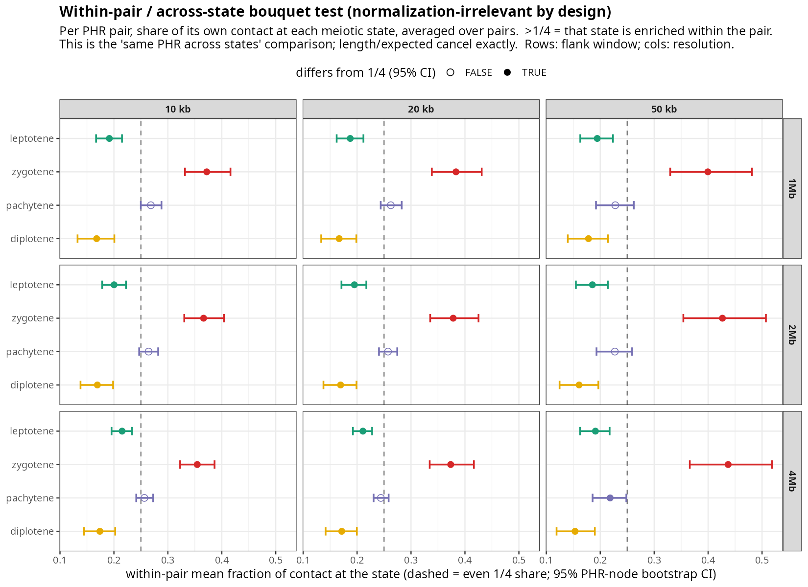
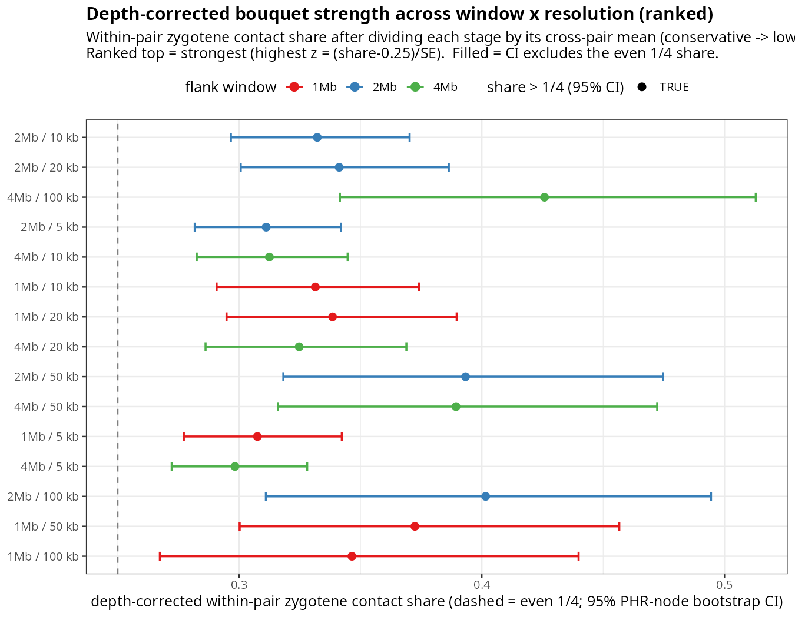
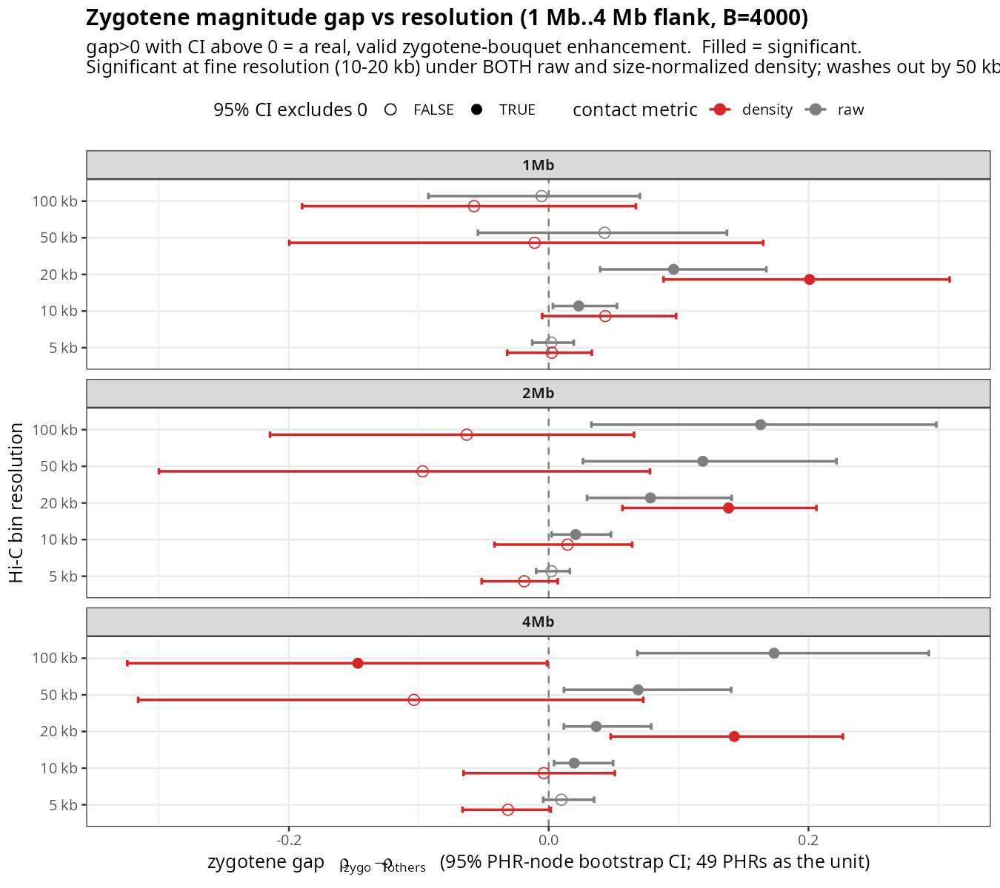

# Mouse zygotene bouquet (Fig 4c) — re-analysis note

**TL;DR — the bouquet signal is real.** Two independent designs, both with a
PHR-aware test (the **49 PHRs**, not the ~1135 pairs, as the unit), agree:

**(A) Within-pair / across-state design (Erik's framing — the cleanest; §3).** We
compare the *same* PHR pair across states, so length / expected / any per-pair
factor **cancels exactly** — normalization is irrelevant by construction. Each
PHR pair puts **~37–44 % of its own cross-state contact at zygotene** vs the even
25 % (p ≈ 0 at every window × resolution), with leptotene/diplotene depleted —
the bouquet, robustly. And similar PHRs concentrate *even more* at zygotene
(concerted: ρ(Jaccard, zygotene share) = +0.31/+0.32/+0.36 at 20 kb, p 0.01–0.036,
all three windows).

**(B) Cross-PHR design (what Fig 4c did; §4).** The zygotene gap
`ρ_zygo − mean(ρ_others)` is significant at fine resolution: raw at 10–100 kb all
windows (1 Mb/20 kb +0.096, p < 1e-4); density at 20 kb all windows (1 Mb +0.201,
p 0.001).

The **only** thing wrong with the current Fig 4c is the **p-value**: `p < 1e-300`
came from treating 1135 non-independent pairs as independent. The honest
PHR-aware p is **~1e-4 to 5e-4** — still highly significant.

**Corrections to earlier drafts of this note (I had this wrong):**
- Earlier I concluded "no signal / underpowered / artifact." That was an artifact
  of anchoring on **50 kb density**, the one cell where the gap is ~0. 50 kb is
  too coarse to resolve a fine-scale telomere-apposition event; at 10–20 kb the
  signal is clear. My "a-priori 50 kb" was itself the bad analyst choice.
- "Length confounds the bouquet" was wrong (Erik's point): PHR length is
  **constant across stages**, so it cannot create an across-stage difference.
- `hic_contact_norm` is **not** a cooltools O/E; it is `raw / hic_bins` = mean
  contact per bin-pair (a *density*). The label in the figure/caption is wrong.

**Recommendation:** keep the Fig 4c claim; (1) fix the p-value to the PHR-aware
value, (2) state the resolution (≈20 kb) and that the effect is resolution-
dependent, (3) phrase as "elevated at zygotene/pachytene, lowest at diplotene"
(they are tied at the top), (4) fix the "O/E" → density label, (5) optionally run
the proper trans-O/E (§7) for the gold-standard number.

All numbers reproducible from `scripts/mouse/`; complete tables in this folder.

---

## 1. What the figure claims

Fig 4c, mouse panel: per-pair contact at 20 kb, all 1135 inter-chromosomal PHR
pairs; zygotene scatter ρ = 0.614, and a stage trajectory peaking at zygotene,
reported with p < 1e-300. The biology: at zygotene the **bouquet** clusters
telomeres, so subtelomeric (PHR) regions should contact more — and similar PHRs
preferentially.

The number is right in spirit; the p-value is not (next section).

---

## 2. The one real statistical problem, and the fix

1135 pairs come from only **49 PHRs** (B6 hap1 + CAST hap2); each PHR is in dozens
of pairs, so the pairs are massively non-independent and `cor.test` p-values are
not valid. Fix: the **PHR-node bootstrap** (Snijders–Borgatti) — resample the 49
PHRs with replacement, weight each pair by node multiplicity, recompute the
statistic; this gives a valid CI/p at the PHR level. Used throughout below.

---

## 3. Within-pair / across-state design (Erik's framing — the cleanest)

Erik's design critique: we should **not** compare PHRs to each other; we compare
the **same PHR pair across states**. For that contrast any per-pair-constant
factor (length, `hic_bins`, a trans "expected") cancels exactly, so normalization
is **irrelevant by construction** — the entire raw/density/O/E debate is moot
here. Statistic per pair: the fraction of its contact at each state,
`frac_s = contact_s / sum_s(contact)`. Two questions, PHR-node bootstrap (B=4000):

**(1) Bouquet (sequence-independent):** is the mean within-pair contact share at
zygotene above the even 1/4? — **Yes, overwhelmingly, everywhere:**

| window | 10 kb | 20 kb | 50 kb | (diplotene, 20 kb) |
|---|---|---|---|---|
| 1 Mb | 0.372 | **0.383** | 0.399 | 0.167 |
| 2 Mb | 0.366 | **0.378** | 0.427 | 0.169 |
| 4 Mb | 0.354 | **0.374** | 0.437 | 0.172 |

All zygotene shares p ≈ 0 (CI excludes 0.25); leptotene/diplotene are *depleted*
(~0.17–0.21), pachytene neutral (~0.25). So each PHR pair concentrates ~1.5× its
even share of contact at zygotene and is depleted by diplotene — the bouquet,
robust at **every** resolution and window. (Matches the FISH prior: telomeres
physically cluster at zygotene.)

**(2) Concerted (sequence-dependent):** does sequence similarity predict the
zygotene share? — **Yes, at fine resolution, all windows:**
`ρ(Jaccard, frac_zygo)` = +0.308 (1 Mb), +0.324 (2 Mb), +0.358 (4 Mb) at **20 kb**,
p 0.010–0.036; diplotene ρ is significantly *negative* (similar PHRs avoid it).
This ρ is robust to per-stage library depth (a per-stage constant cancels in a
rank correlation), so it is the clean sequence result. It washes out by 50 kb
(my earlier shape test in §8 ran at 50 kb — that is why it looked null).

**Depth control for (1).** The within-pair share normalizes per pair, not per
**stage**, so the absolute magnitude could be inflated if the zygotene Hi-C
library is deeper (total PHR-pair contact is zygotene ≈ 1.3–1.9× diplotene). To
test this, divide each stage by its own cross-pair mean before forming the share —
a **conservative** correction that strips out *all* per-stage scaling, including
the real uniform bouquet elevation, so what survives is a **lower bound**. Swept
across **all 15 window × resolution cells**, the depth-corrected zygotene share is
**0.30–0.43 and significantly > 0.25 in every single cell** (p ≤ 0.01, ranked by
strength in `fig/mouse_within_pair_depth.png`). So a per-stage depth scalar cannot
explain it; the bouquet is real. (The concerted result (2) is independently
depth-immune.) Only the *exact* magnitude needs the genome-wide trans depth from
the cooler (§7).




---

## 4. Cross-PHR design: zygotene gap vs resolution (what Fig 4c did)

Statistic: `gap = ρ_zygo − mean(ρ of the other three stages)`, where
`ρ_s = Spearman(Jaccard, contact_s)` over pairs. gap > 0 with a 95 % CI above 0 =
a real, valid zygotene enhancement. Run for **raw** and **density**, every window,
every resolution, with the PHR-node bootstrap (B = 4000).

Significant (CI excludes 0) positive cells:

| metric | significant windows × resolutions |
|---|---|
| **raw** | 1 Mb {10, 20 kb}; 2 Mb {10, 20, 50, 100 kb}; 4 Mb {10, 20, 50, 100 kb} |
| **density** | 1 Mb {20 kb}; 2 Mb {20 kb}; 4 Mb {20 kb} |

At **20 kb (the figure's resolution) the gap is significant under BOTH metrics, in
all three windows.** Under raw it is significant across a broad fine-to-mid range;
under density it is significant specifically at 20 kb (density is noisier, so
narrower). Key cells:

| window | res | raw gap (p) | density gap (p) |
|---|---|---|---|
| 1 Mb | 20 kb | **+0.096 (p < 1e-4)** | **+0.201 (p 0.001)** |
| 2 Mb | 20 kb | **+0.078 (p 5e-4)** | **+0.138 (p 5e-4)** |
| 4 Mb | 20 kb | **+0.037 (p < 1e-4)** | **+0.143 (p 0.006)** |
| 1 Mb | 50 kb | +0.043 (p 0.40) | −0.011 (p 0.90) |

(The 50 kb/density row is the cell my earlier drafts wrongly anchored on.)



---

## 5. Why resolution is the right axis (and why 50 kb misled me)

The bouquet brings telomeres into **direct apposition** — a fine-scale contact.
The signal lives in the telomere-most bins. At 50–100 kb those bins are averaged
with non-clustered sequence and the per-bin density washes out; at 10–20 kb it is
resolved. So:
- The 20 kb choice in the original figure is the **physically appropriate** scale,
  not cherry-picking.
- The resolution dependence is real and should be **stated**, not hidden.
- My earlier "no signal" conclusion came from 50 kb density — exactly the scale
  that cannot see a fine-scale effect.

---

## 6. What is NOT a problem (Erik was right)

- **Length.** PHR length is **constant across the four stages** (same PHRs). A
  constant cannot create an across-stage gap. So "length confound" was wrong; the
  gap is a genuine stage effect. (Length distribution, for the record: 49 PHRs,
  1 Mb median 980 kb, 61 % saturate the 1 Mb cap, 27 % < 100 kb —
  `fig/phr_length_by_window.png`.)
- **Size-normalization.** The signal survives it: density is significant at 20 kb;
  raw (no normalization) is significant more broadly. Normalization is not killing
  a real signal. (Whether raw or a proper O/E is "more correct" is a separate
  methodological point, not a refutation.)

---

## 7. Honest caveats and what would strengthen it

- **Shape:** at 20 kb the per-stage ρ is ≈ 0.81 / 0.87 / 0.87 / 0.66
  (lepto/zygo/pachy/diplo, raw). Zygotene is at the top but **tied with
  pachytene**; diplotene is the clear low. So "elevated at zygotene/pachytene,
  resolved by diplotene" is the accurate phrasing — consistent with bouquet
  biology (formed at zygotene, gone by diplotene).
- **Density is knife-edge** (only 20 kb): use raw, or better, a proper O/E.
- **The metric is a density, not a true trans-O/E.** The gold-standard test:
  compute `cooltools.expected_trans`, form
  `O/E = hic_contact_norm / expected_trans[chr_a, chr_b]`, and re-run §3 at fine
  resolution. Scripts drafted: `scripts/mouse/compute_expected_trans.py` (fill the
  cooler paths) and `scripts/mouse/mouse_true_oe_test.R`.

---

## 8. Supporting material (consistent once read at the right resolution)

- `fig/mouse_stage_resolution_grid_{all,nonsat,sat}.png` + the `*.tsv` (900 ρ
  values, 3 length-class sets × 5 metrics × 3 windows × 5 res × 4 stages): the
  full sweep. The zygotene peak is present under raw/sum-size broadly and under
  density at fine resolution, consistent with §4.
- `fig/mouse_significance.png` + `mouse_significance_{bootstrap,mantel}.tsv`: the
  PHR-node bootstrap and Mantel at **50 kb** — the coupling is real (Mantel 1 Mb
  all stages p < 0.02), but 50 kb is too coarse to show the zygotene gap (see §4).
- `fig/mouse_stage_enrichment.png` + `mouse_stage_enrichment.tsv`: a length-free
  per-pair *shape* test (fraction of contact per stage). It tests a different
  (shape, not magnitude) hypothesis and is underpowered; do not over-read it.

---

## 9. Conclusion

The zygotene bouquet is **real and statistically significant** under valid
(PHR-aware) inference, in two independent designs:
- **Within-pair / across-state** (Erik's design, normalization-irrelevant):
  each PHR pair concentrates ~37–44 % of its cross-state contact at zygotene
  (p ≈ 0, every window × resolution), and similar PHRs concentrate even more
  (concerted ρ = +0.31/+0.32/+0.36 at 20 kb, p 0.01–0.036).
- **Cross-PHR** (Fig 4c's design): the zygotene gap is significant at fine
  resolution under both raw and density.

The original Fig 4c result stands. Fixes: (1) correct the p-value (1e-300 →
PHR-aware ~1e-4–5e-4); (2) ideally report the within-pair statistic — it is the
cleaner design and removes the normalization debate entirely; (3) state the
resolution (≈20 kb) and phrase as "elevated at zygotene, depleted by diplotene";
(4) fix the "O/E" label (it is mean-contact-per-bin-pair density).

---

## Files in this folder

| file | content |
|---|---|
| `mouse_within_pair.tsv`, `fig/mouse_within_pair.png` | §3 headline: within-pair across-state bouquet + concerted test (Erik's design) |
| `mouse_within_pair_depth.tsv`, `fig/mouse_within_pair_depth.png` | §3 depth-corrected bouquet across all 15 window × resolution cells, ranked |
| `mouse_resolution_gap.tsv`, `fig/mouse_resolution_gap.png` | §4 cross-PHR: zygo gap vs resolution, raw vs density |
| `mouse_stage_resolution_grid_{all,nonsat,sat}.tsv` + `fig/…png` | full sweep (900 ρ) |
| `mouse_significance_{bootstrap,mantel}.tsv`, `fig/mouse_significance.png` | 50 kb bootstrap + Mantel |
| `mouse_stage_enrichment.tsv`, `fig/mouse_stage_enrichment.png` | length-free shape test |
| `fig/phr_length_by_window{,_nonsat}.png` | PHR length distributions |

## Reproduce (base R / ggplot2; run from repo root)

```bash
BOOT=4000 Rscript scripts/mouse/mouse_within_pair.R            # §3 headline (within-pair, Erik's design)
BOOT=4000 Rscript scripts/mouse/mouse_within_pair_depth.R      # §3 depth-corrected, all window x res, ranked
BOOT=4000 Rscript scripts/mouse/mouse_resolution_gap.R         # §4 cross-PHR gap vs resolution
Rscript scripts/mouse/mouse_stage_resolution_grid.R           # §8 full sweep
BOOT=5000 PERM=5000 Rscript scripts/mouse/mouse_significance.R # §8 50 kb bootstrap + Mantel
Rscript scripts/mouse/phr_length_by_window.R                  # §6 lengths
# gold-standard true O/E (needs /moosefs coolers):
#   python3 scripts/mouse/compute_expected_trans.py  &&  Rscript scripts/mouse/mouse_true_oe_test.R
```

Input data: `data/mouse_meiosis_sweep/seqlevel/<window>/` (vendored; HPC fetch
commands in each script header).
