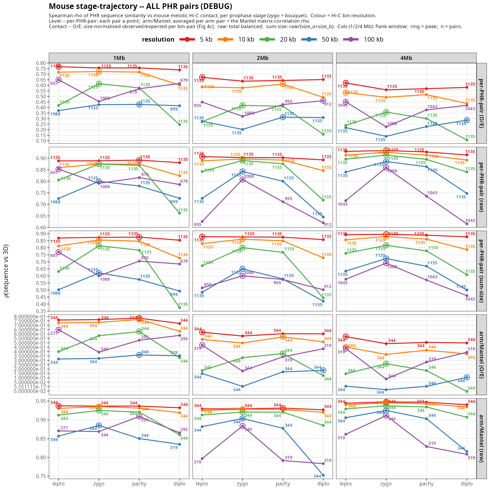
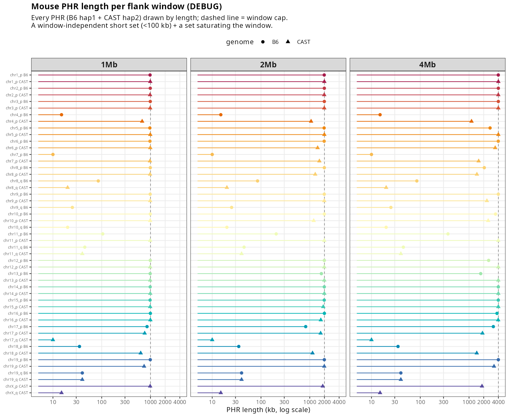
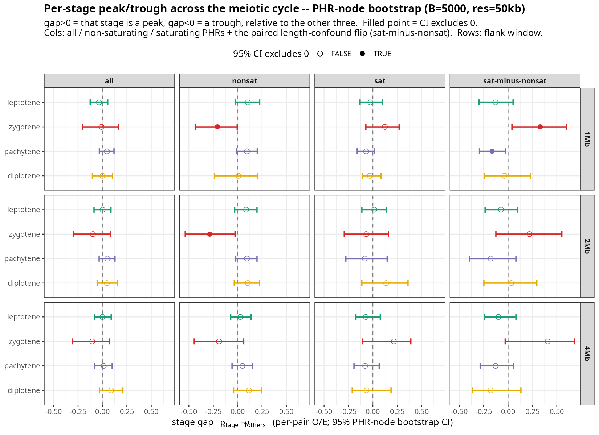

# Is the mouse "zygotene bouquet peak" (Fig 4c) real? — re-analysis note

**TL;DR.** The PHR-sequence ↔ 3D-contact coupling in the mouse meiotic Hi-C is
**real but stage-independent**. The zygotene "bouquet peak" in the current Fig 4c
is **not supported**: it appears only at a specific bin resolution (20 kb) and is
driven by **length-confounded PHRs**. Under the principled, size-normalized
metric the peak is rare-to-absent across the whole parameter space, and once PHR
length is controlled, no meiotic stage is a significant peak (zygotene is if
anything a *trough*). Recommendation: drop the trajectory/bouquet claim; keep the
mouse data as one more example of the (flat-across-stages) sequence→contact
coupling.

All numbers below are reproducible from `scripts/mouse/`. The complete per-cell
results are in the TSVs in this folder.

---

## 1. What the figure currently claims (what was "picked")

Current Fig 4c: mouse panel, **per-PHR-pair O/E contact at 20 kb bins**, all 1135
inter-chromosomal PHR pairs treated as independent.

- zygotene scatter ρ = 0.614, n = 1135, p < 1e-300
- stage trajectory (lepto / **zygo** / pachy / diplo) = 0.419 / **0.614** / 0.576 / 0.245
  → reads as a peak at the zygotene bouquet.

Two problems: (a) the p-value is computed on 1135 pairs that come from only
**49 PHRs**, so it is massively anti-conservative; (b) the result is a single
point in a large parameter space and is fragile to the choices made.

---

## 2. The full parameter space we explored

The x-axis is always the same: PHR-pair **Jaccard sequence similarity**. The
y-axis is always **Spearman ρ** between that Jaccard and a 3D-contact metric. We
swept every combination of the following.

**(A) PHR length-class set** (3): how the PHRs are filtered.
- `all` — every inter-chromosomal PHR pair.
- `nonsat` (non-saturating) — both PHRs **below** 95 % of the flank-window cap
  → length set by real homology.
- `sat` (saturating) — both PHRs **at/above** 95 % of the cap → length pinned by
  the window.

**(B) Contact metric = aggregation level × normalization** — everything we put on
the y-axis (6 metrics; rows of the grids):

*Aggregation level*
- **per-PHR-pair** — each inter-chromosomal PHR sequence pair is one point
  (~1135).
- **arm / Mantel** — pairs averaged to one value per chromosome-arm pair; the
  arm-level Spearman over those arm-pair entries **is the Mantel matrix
  correlation** (~26–27 arms, ~319–344 arm pairs).

*Contact normalization*
- **O/E** (`hic_contact_norm`) — observed/expected per bin-pair, size-normalized
  (cooltools `expected_trans`). Removes the PHR-length / coverage bias.
  **Principled choice; what current Fig 4c uses and what the §6 tests use.**
- **raw** (`hic_contact_raw`) — total balanced contact over the PHR region, **not**
  size-normalized → scales with PHR length → length-confounded.
- **sum-size** — `hic_contact_raw / (size_a + size_b)` — the slide's per-pair
  "Sum-method" size normalization.
- **slide** — the published old-figure arm contact (`analyze_hic_communities.py`):
  balanced matrix → sum over each arm's PHR regions → ÷ (size_i + size_j) →
  zero diagonal → rescale [0,1]. **Arm-level only** (precomputed, no per-PHR
  size), so it cannot be length-class filtered; tried separately (it also shows
  the zygotene peak — its old-figure trajectory was 0.687/0.718/0.683/0.577,
  peaking at zygo — consistent with being length-confounded), and omitted from
  the length-stratified grids here.

The grids therefore show **5 length-filterable metrics**: per-PHR-pair {O/E, raw,
sum-size} and arm/Mantel {O/E, raw}.

**(C) Flank window** (3): 1 / 2 / 4 Mb.
**(D) Hi-C bin resolution** (5): 5 / 10 / 20 / 50 / 100 kb.
**(E) Meiotic stage** (4): leptotene, **zygotene** (bouquet), pachytene, diplotene.

**Total trajectory cells** = 3 sets × 5 metrics × 3 windows × 5 resolutions = 225
trajectories, each over 4 stages → **900 ρ values**, all in
`mouse_stage_resolution_grid_{all,nonsat,sat}.tsv` (columns: `pair_norm`,
`pair_raw`, `pair_sumsize`, `arm_norm`, `arm_raw`). The three grid PNGs visualize
all of them.

---

## 3. How often is zygotene actually the peak? (robustness over the whole space)

For each set × metric, count the (window × resolution) cells where **zygotene is
the argmax stage** (out of 12 cells with complete data):

| set | per-pair O/E | per-pair raw | per-pair sum-size | arm O/E | arm raw |
|---|---|---|---|---|---|
| **all** | **4/12** | 10/12 | 10/12 | **1/12** | 10/12 |
| **nonsat** | **0/12** | 4/12 | 5/12 | 1/12 | 7/12 |
| **sat** | 5/12 | 5/12 | 5/12 | 6/12 | 3/12 |

Read this row by row:

- Under the **length-confounded** metrics (raw, sum-size, arm raw) the zygotene
  peak dominates the `all` set (**10/12**). This is where the published claim
  comes from.
- Under the **principled, size-normalized O/E** the peak is rare: **4/12**
  per-pair and **1/12** arm-level in `all`, and **0/12** in the real-length
  (`nonsat`) PHRs.
- The peak resurges in the **saturating** PHRs (per-pair O/E 5/12, arm O/E 6/12)
  — i.e. it tracks PHR length, not the metric.

So the bouquet peak is a property of *which contact normalization and which PHRs*
you choose, and it is exactly the length-confounded choices that produce it.



---

## 4. The a-priori line is flat (per-PHR-pair O/E, 50 kb)

Complete per-pair O/E trajectory at 50 kb, every set × window:

| set | window | n | lepto | zygo | pachy | diplo |
|---|---|---|---|---|---|---|
| all | 1 Mb | 999 | 0.372 | 0.425 | **0.428** | 0.416 |
| all | 2 Mb | 1135 | 0.276 | 0.202 | **0.313** | 0.309 |
| all | 4 Mb | 1135 | 0.219 | 0.141 | 0.229 | **0.286** |
| nonsat | 1 Mb | 159 | **0.384** | 0.151 | 0.378 | 0.313 |
| nonsat | 2 Mb | 310 | 0.341 | 0.060 | 0.347 | **0.354** |
| nonsat | 4 Mb | 442 | 0.232 | 0.068 | 0.248 | **0.298** |
| sat | 1 Mb | 339 | 0.109 | **0.221** | 0.063 | 0.131 |
| sat | 2 Mb | 245 | 0.314 | 0.252 | 0.240 | **0.405** |
| sat | 4 Mb | 148 | 0.292 | **0.506** | 0.286 | 0.297 |

At the principled line (1 Mb flank = the PHR definition, 50 kb, `all`),
pachytene ≥ zygotene — **no bouquet peak**. The peak is the max only in the
saturating set (1 Mb, 4 Mb).

---

## 5. Mechanism: PHR length is a window artifact and confounds contact

`phr_length_by_window.png` — every PHR (49; B6 hap1 + CAST hap2) by length, per
window.

- ~27 % are a window-independent **short set** (<100 kb).
- The rest **saturate the flank window** (≥95 % of cap: 61 % / 47 % / 37 % at
  1 / 2 / 4 Mb; median length 980 / 1845 / 2525 kb).

PHR length is largely set by the window, not biology, and raw contact scales with
length → the confound. (`phr_length_by_window_nonsat.png`: even after dropping
PHRs that saturate at 4 Mb, most still ride the cap at 1–2 Mb; only ~13 PHRs have
a window-stable length.)



---

## 6. Structure-aware significance (49 PHRs as the unit, not 1135 pairs)

`mouse_significance.png`. Full numbers: `mouse_significance_bootstrap.tsv`
(per-stage gap, per set × window, B = 5000) and `mouse_significance_mantel.tsv`
(P = 5000).

**Test 1 — PHR-node bootstrap.** Per-stage gap = ρ(stage) − mean(ρ of the other
three); gap>0 peak, gap<0 trough; `*` = 95 % CI excludes 0. Per-pair O/E, 1 Mb,
50 kb:

| set | lepto | zygo | pachy | diplo |
|---|---|---|---|---|
| **all** | −0.035 (p 0.45) | −0.011 (p 0.94) | +0.046 (p 0.23) | −0.000 (p 0.99) |
| non-sat | +0.104 (p 0.11) | **−0.207 (p 0.043)** \* | +0.095 (p 0.085) | +0.009 (p 0.84) |
| sat | −0.025 (p 0.73) | +0.123 (p 0.21) | −0.068 (p 0.11) | −0.030 (p 0.64) |
| flip (sat−nonsat) | −0.128 (p 0.18) | **+0.331 (p 0.022)** \* | **−0.163 (p 0.022)** \* | −0.039 (p 0.74) |

- **In the principled full set, no stage is a significant peak** (all gaps ≈ 0,
  p > 0.2).
- The only stage-specific signal is the zygotene **trough** in real-length PHRs
  (1 Mb p = 0.043; also 2 Mb p = 0.028) — opposite of a bouquet.
- At 4 Mb nothing is significant anywhere.

**Test 2 — Mantel permutation** (arm-level O/E):

| window | lepto | zygo | pachy | diplo |
|---|---|---|---|---|
| **1 Mb** | 0.337 (p 0.019) \* | **0.296 (p 0.005)** \* | 0.382 (p 0.004) \* | 0.352 (p 0.019) \* |
| 2 Mb | 0.149 (p 0.16) | 0.002 (p 0.50) | 0.168 (p 0.11) | 0.185 (p 0.11) |
| 4 Mb | 0.004 (p 0.49) | −0.035 (p 0.61) | 0.003 (p 0.48) | 0.106 (p 0.23) |

Arm-level coupling is significant **only at 1 Mb**, for **all four stages**, and is
**flat** — zygotene is the *lowest* (0.296).

**Multiple testing.** 36 gap tests + 12 flips + 12 Mantel; the few p ≈ 0.02–0.04
hits would mostly not survive Bonferroni/FDR. The robust result is the negative
one (no peak in the full set).



---

## 7. Conclusion and recommendation

- **Keep:** "PHR sequence similarity predicts 3D contact" — significant at the arm
  level, 1 Mb, every meiotic stage (Mantel p < 0.02).
- **Drop:** "concerted contacts peak at the zygotene bouquet." Under the
  principled size-normalized metric it is rare-to-absent across 900 ρ values
  (0/12 in real-length PHRs), all per-stage gaps are ns in the full set, the
  arm-level zygotene is the *lowest* of the four stages, and once PHR length is
  controlled it is significantly *reversed*. It is an artifact of (i) choosing
  20 kb bins and (ii) length-confounded contact (raw / sum-size / slide) on
  length-saturating PHRs.
- **Figure change proposed:** Fig 4c keeps the mouse sequence↔contact scatter as
  one example of the stage-independent coupling and **removes the per-stage
  trajectory panel and the bouquet wording**. This analysis goes to the
  supplement.

---

## Files in this folder

| file | content |
|---|---|
| `mouse_stage_resolution_grid_{all,nonsat,sat}.tsv` | every ρ (900 values): 3 sets × 5 metrics × 3 windows × 5 res × 4 stages |
| `fig/mouse_stage_resolution_grid_{all,nonsat,sat}.png` | the grids (5 metrics × 3 windows, 5 resolutions overlaid) |
| `fig/phr_length_by_window{,_nonsat}.png` | §5 PHR-length distributions |
| `mouse_significance_{bootstrap,mantel}.tsv`, `fig/mouse_significance.png` | §6 structure-aware tests |

## Reproduce (base R / ggplot2; run from repo root)

```bash
Rscript scripts/mouse/phr_length_by_window.R                    # §5 (FILTER=nonsat for the inset)
Rscript scripts/mouse/mouse_stage_resolution_grid.R            # §2–4 grids (all/nonsat/sat)
BOOT=5000 PERM=5000 Rscript scripts/mouse/mouse_significance.R  # §6 bootstrap + Mantel
```

Input data: `data/mouse_meiosis_sweep/seqlevel/<window>/` (vendored; HPC fetch
commands in each script header).
